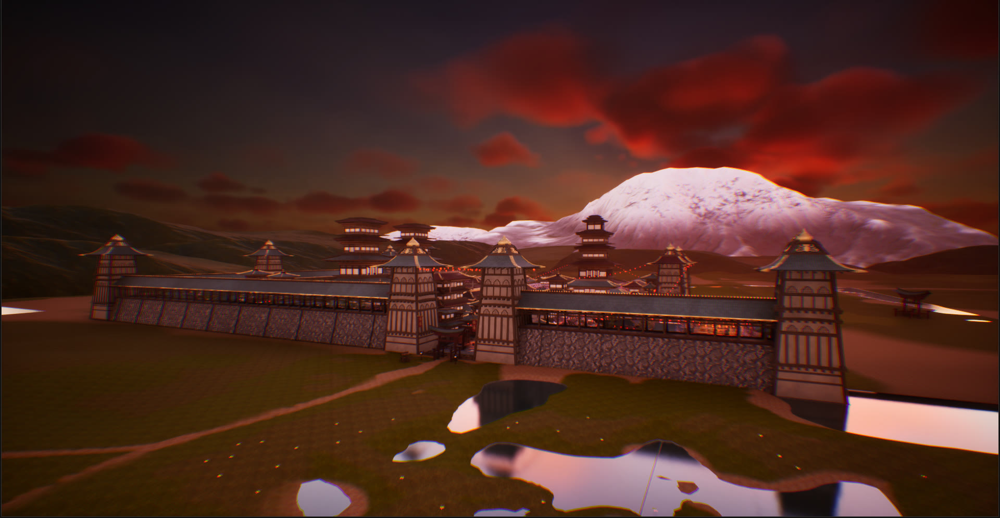
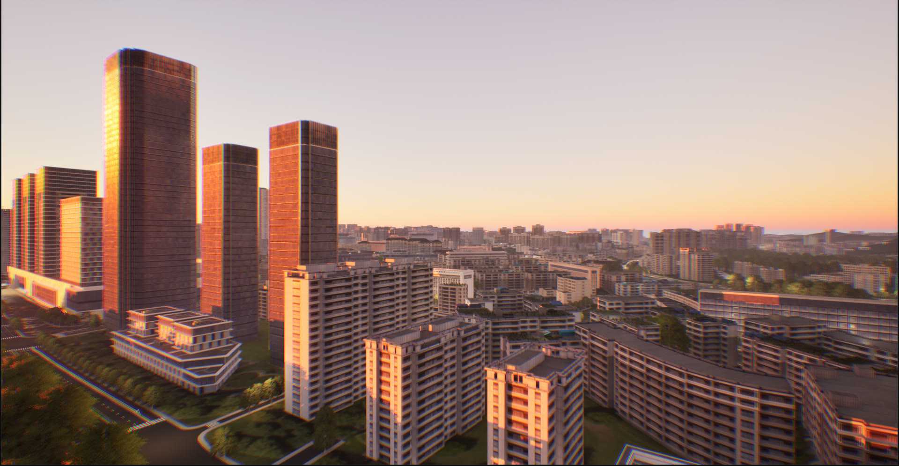
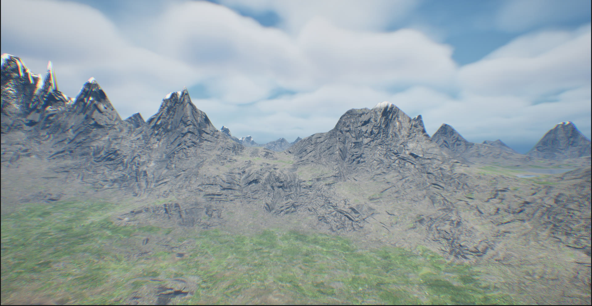

# Optical Navigation UE5 Simulator

An Unreal Engine 5 simulator used to generate synthetic imagery and ground
truth for research on **vision-based / optical UAV navigation**.

A simulated quadcopter flies a scripted spline path through a virtual
environment while a fixed camera rig records:

* **Nadir (downward) imagery** for visual-odometry-style navigation, paired
  with dense 6-DoF ground truth;
* **North- and west-facing skyline imagery**, each with a derived binary
  **sky mask** computed from a co-located depth capture;
* a **per-run manifest** recording the coordinate conventions, camera
  calibration, environment settings and path configuration the run was
  produced under.

Everything runs at a fixed 60 Hz timestep so that recorded timing is
deterministic and reproducible.

> **Scope.** This repository contains the simulator — code, Blueprints, levels,
> configuration and terrain sources. It does **not** contain the commercial
> Marketplace/Fab assets the levels reference, and it does **not** contain the
> recorded datasets. Both are addressed below.

---

## Environments

Captured in-engine from the simulator. Each filename records the environment
preset the shot was taken under, which is the same `time_of_day` / `clouds`
configuration written into every run's `settings.json`.


<p align="center"><em><code>asian_village_hills_background</code> — dusk, cloudy</em></p>


<p align="center"><em><code>large_flat_city</code> — dawn, clear</em></p>


<p align="center"><em><code>mountains</code> — day, very cloudy. Terrain generated from the heightmaps in <code>Resources/Heightmaps/</code>.</em></p>

> These are rendered screenshots, not redistributable assets. The environment
> art and landscape material they depict are third-party works shown here for
> illustration; they remain the property of their respective creators and are
> not included in this repository. See
> [THIRD_PARTY_ASSETS.md](THIRD_PARTY_ASSETS.md).

---

## 1. What this simulator does

| Capability | Implementation |
|---|---|
| Nadir VO capture + calibration | `UExperimentLoggerComponent` — captures a downward `SceneCaptureComponent2D` every *N* ticks, derives a pinhole model (fx, fy, cx, cy) from render-target size and FOV |
| Dense ground truth | Camera and body pose in raw UE coordinates plus a derived right-handed ENU frame, heading, camera tilt, barometric-relative altitude, and true AGL / terrain elevation from a downward ray trace |
| Skyline observation | North + west RGB captures, each paired with a binary sky mask thresholded from a depth capture, cross-referenced to the VO frame captured on the same tick |
| Scripted flight | `UDronePathFollowerComponent` — spline following with configurable cruise speed, look-ahead, and yaw mode (*keep initial* / *follow movement*) |
| Environment control | `BP_EnvironmentManager` with time-of-day and cloud-preset enumerations (clear / cloudy / very cloudy / rain) |
| Live telemetry | `UTelemetrySenderComponent` — UDP pose stream to `127.0.0.1` for external tooling |

The recorded output format is documented in
**[docs/DATA_FORMAT.md](docs/DATA_FORMAT.md)**.

## 2. Repository scope

The levels in this repository are original compositions, but they *reference*
third-party Marketplace/Fab assets by Content Browser path. Those assets are
**intentionally not redistributed** — their licenses do not permit it.

A clone of this repository therefore contains the complete simulator logic and
scene layout, but the referenced art must be installed separately before the
levels will render as they did for the thesis. Every required asset, its role,
and the exact folder it must be installed to is listed in
**[THIRD_PARTY_ASSETS.md](THIRD_PARTY_ASSETS.md)**.

## 3. Requirements

* **Unreal Engine 5.4** (set by `EngineAssociation` in
  `OnlineDroneSimulator.uproject`)
* **Visual Studio 2022** with the *Game development with C++* workload — this
  is a C++ project and must be compiled
* **Windows** — the project targets DirectX 12 / SM6 and enables the
  `HardwareEncoders` plugin

Engine plugins enabled (all ship with Unreal, nothing extra to install):
`ModelingToolsEditorMode`, `PixelStreaming`, `HardwareEncoders`, `Volumetrics`.

No third-party *plugins* are required. The Off World Live Livestreaming
Toolkit present in the author's original project was disabled and has been
removed from the plugin list.

## 4. Required Marketplace/Fab assets

Not included. Install each into the exact folder shown, or Unreal cannot
resolve the level's references:

| Asset | Role | Install to |
|---|---|---|
| [Quadcopter pack](https://www.fab.com/listings/1a6818f8-2c0e-4ab9-93d9-6ff2d432a734) | The UAV pawn — required by **every** level | `Content/Quadcopters/` |
| [Asian village / hills](https://www.fab.com/listings/cebef7c2-a093-42e0-a3ce-dcd7c06317da) | Environment for `asian_village_hills_background` | `Content/Asian_town/` |
| [Large flat city](https://www.fab.com/listings/cfea5a68-2931-40a5-a578-82261247e664) | Environment for `large_flat_city` | `Content/ChineseCity/` |
| Seyeonjeong Pavilion | Environment for `hills_with_forest` (the default map) | `Content/SeyeonjeongPavilion/` |
| MAWI Landscape Auto Material | Landscape material for **both** mountain levels | `Content/MWLandscapeAutoMaterial/` |
| Dynamic Mesh Creator | Referenced by `large_flat_city` | `Content/DynamicMeshCreator/` |

> The last three entries have **placeholder source URLs** in
> [THIRD_PARTY_ASSETS.md](THIRD_PARTY_ASSETS.md) pending confirmation by the
> author.

The drone Blueprints used for the experiments are *modified* versions of the
Quadcopter pack's Blueprints and are likewise not redistributed.
**[docs/DRONE_SETUP.md](docs/DRONE_SETUP.md)** documents the exact component
layout, tags and settings needed to rebuild them on your own copy of the pack.

## 5. Terrain / heightmaps

The mountain terrain was generated for this project using **World Machine
Basic**. Both 1024 × 1024 16-bit grayscale height outputs are committed under
`Resources/Heightmaps/` and are covered by this repository's MIT license.

You normally do **not** need to import them — the mountain levels ship with
their landscape data already built. They are included for provenance and so
the terrain can be regenerated or modified. Import instructions and the
caveat about Unreal's recommended landscape resolutions are in
**[docs/TERRAIN.md](docs/TERRAIN.md)**.

## 6. Setup

```bash
git clone https://github.com/AdiPassover/Optical-Navigation-UE5-Simulator.git
cd Optical-Navigation-UE5-Simulator
```

1. **Install the Fab assets** from section 4 into the folders listed. Do this
   *before* opening the project, so Unreal resolves references on first load.
2. **Generate project files** — right-click `OnlineDroneSimulator.uproject`
   → *Generate Visual Studio project files*. (The `.sln` is generated, not
   committed.)
3. **Build** the `Development Editor | Win64` configuration in Visual Studio,
   or simply open the `.uproject` and let Unreal prompt you to rebuild the
   module.
4. **Open** `OnlineDroneSimulator.uproject`. Shader compilation on first load
   takes a while.
5. **Rebuild lighting** if a level looks unlit — baked lighting data
   (`*_BuiltData.uasset`) is generated and deliberately not committed.
6. **Rebuild the drone pawn** per [docs/DRONE_SETUP.md](docs/DRONE_SETUP.md)
   and place it in the level you want to fly.

## 7. Project structure

```
Config/                     Project settings (60 Hz fixed timestep, DX12/SM6, input)
Source/OnlineDroneSimulator/
    ExperimentLoggerComponent.*   Capture + logging: the data generation core
    DronePathFollowerComponent.*  Spline path following
    TelemetrySenderComponent.*    UDP telemetry output
Content/
    Levels/                 The five experiment levels
    DronePath/              Seven spline path Blueprints
    SkyManager/             BP_EnvironmentManager, time-of-day / cloud presets
    RenderTargets/          Render targets for the five scene captures
    Target/                 Path point and target actors
    HUDs/, DroneModes/      Flight HUD and capture-mode assets
    __ExternalActors__/     World Partition actor data for the mountain levels
    __ExternalObjects__/
Resources/Heightmaps/       World Machine terrain outputs (16-bit PNG)
docs/                       Data format, drone rig setup, terrain notes
```

### Levels

| Level | Environment | Third-party dependency |
|---|---|---|
| `mountains` | World Machine terrain, steeper | MAWI Landscape Auto Material |
| `mountains_less_steep` | World Machine terrain, gentler — editor startup map | MAWI Landscape Auto Material |
| `asian_village_hills_background` | Village + hills | Asian village pack |
| `hills_with_forest` | Forested hills + pavilion — **default game map** | Seyeonjeong Pavilion |
| `large_flat_city` | Dense flat urban | Large flat city, Dynamic Mesh Creator |

## 8. Running the simulator

1. Open one of the levels above in the editor.
2. Place your rebuilt drone pawn, or verify the existing one, and confirm the
   five capture components carry their tags (`NadirCapture`, `NorthCapture`,
   `WestCapture`, `NorthDepthCapture`, `WestDepthCapture`) and the body
   carries `DroneBody`.
3. Place or select one of the `BP_DronePath*` spline actors from
   `Content/DronePath/`.
4. Press **Play**.
5. Drive the run from Blueprint: call `Initialize` then `StartFollowingPath`
   on `UDronePathFollowerComponent`, and `StartExperiment` on
   `UExperimentLoggerComponent`.

Keep the editor at the fixed 60 Hz timestep. The logger validates the actual
tick delta against `ExpectedSimulationRateHz` and warns if they diverge.

## 9. Data generation

Calling `StartExperiment(...)` creates

```
Saved/SimulatorRuns/Run_<YYYYmmdd_HHMMSS>/
```

containing `settings.json`, `vo/frames.csv`, `vo/groundtruth.csv`,
`vo/images/`, `skyline/observations.csv`, `skyline/images/` and
`skyline/sim/`.

With default settings (60 Hz, `NadirCaptureEveryNTicks = 6`) this yields
**10 Hz imagery** with **60 Hz dense ground truth**. Skyline observations are
requested via `QueueSkylineCapture()` and are tied to the VO frame captured on
the same tick.

Full column-by-column schema, coordinate conventions and sky-mask definition:
**[docs/DATA_FORMAT.md](docs/DATA_FORMAT.md)**.

## 10. Research reproducibility

The recorded datasets used for the thesis experiments are **not** in this
repository. They will be distributed separately through a public archival
dataset repository.

**Dataset DOI: to be added.**

This repository is the simulator that produced them; the dataset release is
the record of what was produced.

### Known reconstruction limitations

* The drone Blueprints are derivative works of a licensed pack and are not
  redistributed. The pawn must be rebuilt from
  [docs/DRONE_SETUP.md](docs/DRONE_SETUP.md); a rebuilt pawn will match
  functionally but may not match the original in mass, drag or other tuned
  physics values, which are not recorded outside the excluded Blueprint.
* Levels open with missing actors until the corresponding Fab assets are
  installed at the documented paths.
* Baked lighting is not committed and must be rebuilt, so lighting may differ
  slightly from the recorded runs.
* Landscape scale values for the mountain levels live inside the committed
  landscape actors rather than in any text file.

## 11. Licensing

| Material | License |
|---|---|
| C++ source, Blueprints, levels, configuration, heightmaps and documentation **authored for this repository** | **MIT** — see [LICENSE](LICENSE) |
| Marketplace/Fab assets referenced by the levels | **Not included.** Governed by their own licenses; obtain from the original source. See [THIRD_PARTY_ASSETS.md](THIRD_PARTY_ASSETS.md) |
| Unreal Engine | Not included. [Unreal Engine EULA](https://www.unrealengine.com/eula) |

The MIT license covers **only** material authored for this repository. It makes
no claim over any third-party asset. The committed level files reference
third-party assets by path but contain none of their meshes, textures or
materials.

## 12. Citation

If you use this simulator in academic work, please cite it. Machine-readable
metadata is in [CITATION.cff](CITATION.cff).

```bibtex
@software{passover_optical_navigation_ue5_simulator,
  author  = {Passover, Adi},
  title   = {Optical Navigation UE5 Simulator},
  url     = {https://github.com/AdiPassover/Optical-Navigation-UE5-Simulator},
  year    = {2026}
}
```

The thesis citation and dataset DOI will be added once available.
